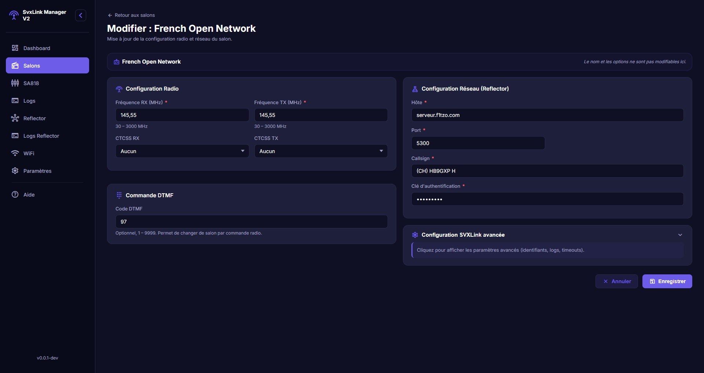
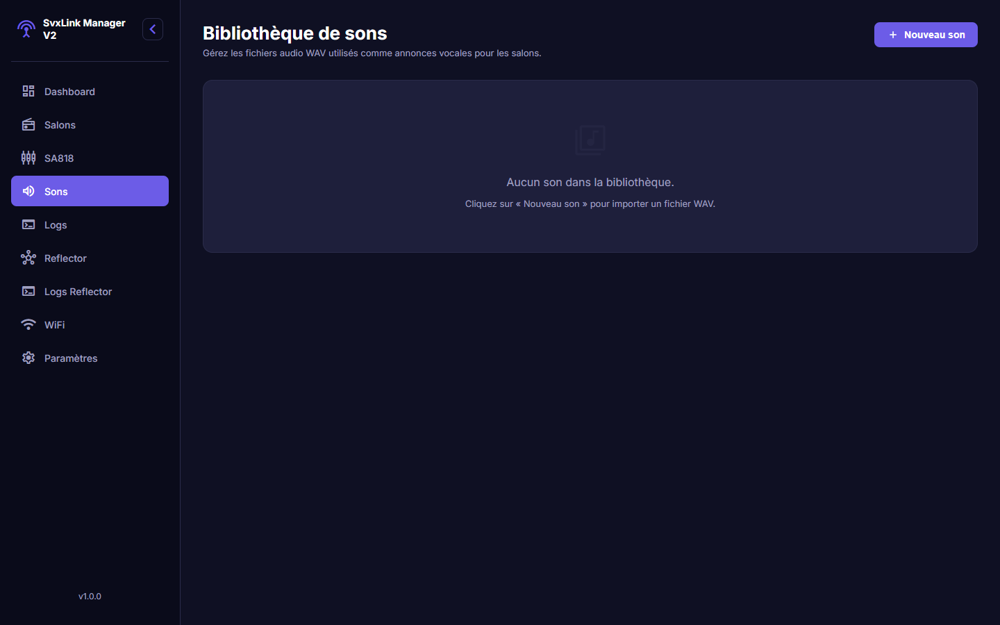

# SvxLink Manager V2

SvxLink Manager V2 est une interface web de pilotage pour une station SVXLink.

L'objectif du logiciel est simple : centraliser, dans un seul outil, les actions quotidiennes d'exploitation d'un noeud radioamateur SVXLink (gestion des salons, configuration radio, sons, reflector, supervision et reseau Wi-Fi).

## A quoi sert le logiciel

Le logiciel permet de :

- piloter rapidement l'etat de l'installation SVXLink depuis un tableau de bord
- preparer et maintenir plusieurs configurations de salons (frequences, CTCSS, hote/port)
- basculer en exploitation d'un salon a un autre sans reconfigurer manuellement les fichiers
- administrer les annonces vocales WAV utilisees par les salons
- regler les parametres radio du module SA818
- configurer et superviser SvxReflector
- suivre les logs SVXLink et Reflector en temps reel
- gerer les connexions Wi-Fi de la machine (scan, connexion, activation, suppression)
- definir le comportement automatique au demarrage

## Fonctionnalites deja implementees

### Tableau de bord

- affichage du salon actif
- affichage du nombre de noeuds connectes et des noeuds en emission
- etat en direct des services SVXLink et SvxReflector
- resume de la configuration SA818 (volume, squelch)
- activation rapide d'un salon
- desactivation du salon actif

### Gestion des salons

- creation d'un salon
- edition d'un salon existant
- suppression d'un salon (avec protection des cas critiques)
- activation et desactivation d'un salon
- definition d'un salon par defaut
- gestion des salons temporises
- visualisation des parametres principaux : hote, port, RX/TX, CTCSS

### Bibliotheque de sons

- import de fichiers WAV
- validation du format audio attendu
- renommage d'un son
- remplacement du fichier audio d'un son existant
- suppression d'un son
- affichage des metadonnees audio (duree, frequence d'echantillonnage, canaux)

### Module SA818

- lecture de la configuration actuelle
- reglage du volume
- reglage du squelch
- choix de la largeur de bande (12.5 kHz ou 25 kHz)
- activation/desactivation des filtres audio (PreEmph, HighPass, LowPass)
- enregistrement de la configuration

### SvxReflector

- creation automatique d'une configuration initiale au premier demarrage
- edition du contenu de configuration du reflector
- sauvegarde de la configuration
- demarrage et arret du reflector
- prevention des modifications de configuration quand le service est actif

### Logs et supervision

- consultation des logs SVXLink en temps reel
- consultation des logs Reflector en temps reel
- indication d'etat actif/arrete des daemons
- filtrage texte des logs
- limitation du nombre de lignes conservees
- effacement des logs
- auto-scroll intelligent

### Reseau Wi-Fi

- scan des reseaux disponibles
- affichage de l'etat de connexion (connecte/deconnecte)
- connexion a un nouveau reseau (SSID + mot de passe)
- activation d'un profil existant
- deconnexion
- suppression d'un profil Wi-Fi

### Parametres generaux

- option de demarrage automatique du reflector au lancement de l'application
- option de demarrage automatique du salon par defaut au lancement

## Illustrations

### Tableau de bord

### Salons

### Ajout d'un salon

### Reflector

### Wi-Fi

### Sons

## Pour qui

SvxLink Manager V2 cible principalement :

- les radioamateurs qui exploitent un noeud SVXLink
- les responsables de relais/noeuds qui veulent une interface unifiee
- les installations qui ont besoin d'operations rapides sans passer par des editions manuelles de fichiers

## Resultat attendu en exploitation

Avec ce logiciel, l'exploitation quotidienne est plus fiable et plus rapide : moins de manipulations manuelles, meilleure visibilite de l'etat de la station, et changements de configuration plus sereins.
