# SvxLink Manager

SvxLink Manager est une interface web de pilotage pour une station SVXLink.

L'objectif du logiciel est simple : centraliser, dans un seul outil, les actions quotidiennes d'exploitation d'un noeud radioamateur SVXLink (gestion des salons, configuration radio, reflector, supervision et reseau Wi-Fi).

## A quoi sert le logiciel

Le logiciel permet de :

- piloter rapidement l'etat de l'installation SVXLink depuis un tableau de bord
- preparer et maintenir plusieurs configurations de salons (frequences, CTCSS, hote/port, callsign, cle d'authentification)
- basculer en exploitation d'un salon a un autre sans reconfigurer manuellement les fichiers
- changer de salon par commande DTMF depuis le transceiver
- regler les parametres radio du module SA818 (volume, squelch, bande, filtres)
- configurer et superviser SvxReflector local
- suivre les logs SVXLink et Reflector en temps reel
- gerer les connexions Wi-Fi de la machine (scan, connexion, activation, suppression)
- definir le comportement automatique au demarrage
- mettre a jour l'application directement depuis l'interface

## Fonctionnalites implementees

### Tableau de bord

- affichage du salon actif avec son etat (actif / inactif)
- affichage du nombre de noeuds connectes et des noeuds en emission
- etat en direct des services SVXLink et SvxReflector (actif / arrete)
- resume de la configuration SA818 (volume, squelch)
- activation rapide d'un salon depuis un menu deroulant
- desactivation du salon actif en un clic
- liste en temps reel des noeuds connectes au reflecteur

### Gestion des salons

- creation d'un salon avec configuration complete
- edition d'un salon existant (parametres radio, reseau, DTMF, configuration avancee)
- suppression d'un salon (avec protection des cas critiques)
- activation et desactivation d'un salon (genere et deploie svxlink.conf)
- definition d'un salon par defaut (activation automatique au demarrage)
- filtrage de la liste par etat (actif, defaut, temporise)
- visualisation des parametres principaux : hote, port, RX/TX MHz, CTCSS

#### Formulaire de salon — champs disponibles

**Informations generales** (creation uniquement) :
- Nom du salon
- Code DTMF (optionnel, 1–9999)
- Salon par defaut (toggle)
- Temporise (deconnexion automatique apres inactivite)

**Configuration Radio** :
- Frequence RX (MHz)
- Frequence TX (MHz)
- CTCSS RX (liste complete des tonalites standard)
- CTCSS TX (liste complete des tonalites standard)

**Configuration Reseau (Reflector)** :
- Hote du reflecteur
- Port
- Callsign
- Cle d'authentification

**Configuration SVXLink avancee** (section repliable) :
- Callsign Simplex
- Intervalle d'identification court (secondes)
- Intervalle d'identification long (secondes)
- Delai son de roger (ms)
- Langue par defaut (fr_FR, etc.)

### Commandes DTMF

- changement de salon par code DTMF (codes 1–9999 assignes par salon)
- annonces vocales par DTMF (codes 300–399)
- code 300 : rejoue le nom du salon actif en synthese vocale
- page d'aide recapitulant tous les codes DTMF configures sur le noeud

### Module SA818

- lecture et affichage de la configuration actuelle avec date/heure de mise a jour
- reglage du volume audio (curseur 1–8 avec visualisation graphique)
- reglage du squelch (curseur 0–8)
- choix de la largeur de bande : 12,5 kHz (NFM) ou 25 kHz (WFM)
- activation/desactivation des filtres audio :
  - Pre-accentuation (PreEmph) — boost des hautes frequences
  - Filtre passe-haut (HighPass) — attenue les basses frequences en dessous de 300 Hz
  - Filtre passe-bas (LowPass) — attenue les hautes frequences au-dessus de 3 kHz
- remise aux valeurs par defaut
- enregistrement de la configuration

### SvxReflector

- creation automatique d'une configuration initiale au premier demarrage
- edition directe du fichier svxreflector.conf (format INI) dans l'interface
- sauvegarde de la configuration
- demarrage et arret du daemon svxreflector
- prevention des modifications de configuration quand le service est actif
- annonces vocales automatiques lors de connexion/deconnexion de noeuds

### Logs et supervision

- consultation des logs SVXLink en temps reel
- consultation des logs Reflector en temps reel
- indicateur d'etat du daemon (actif / arrete)
- filtrage texte des logs
- configurable : nombre maximum de lignes conservees
- compteur de lignes affichees
- effacement des logs
- auto-scroll intelligent (reste en bas si actif, ne perturbe pas la lecture manuelle)

### Reseau Wi-Fi

- affichage de la connexion courante (SSID, force du signal en %)
- scan et liste des reseaux disponibles (SSID, securite, canal, signal)
- connexion a un nouveau reseau (SSID + mot de passe)
- connexion directe a un profil deja sauvegarde
- deconnexion du reseau actif
- suppression d'un profil Wi-Fi sauvegarde
- rafraichissement manuel de la liste

### Parametres generaux

- demarrage automatique du reflecteur au lancement de l'application
- demarrage automatique du salon par defaut au lancement
- configuration sans reflecteur : frequences RX/TX par defaut pour le mode DTMF autonome
- gestion des mises a jour :
  - affichage de la version installee et du canal (Stable / Dev)
  - verification de la disponibilite d'une nouvelle version
  - telechargement du paquet .deb depuis GitHub Releases
  - installation de la derniere version telechargee

## Illustrations

### Tableau de bord

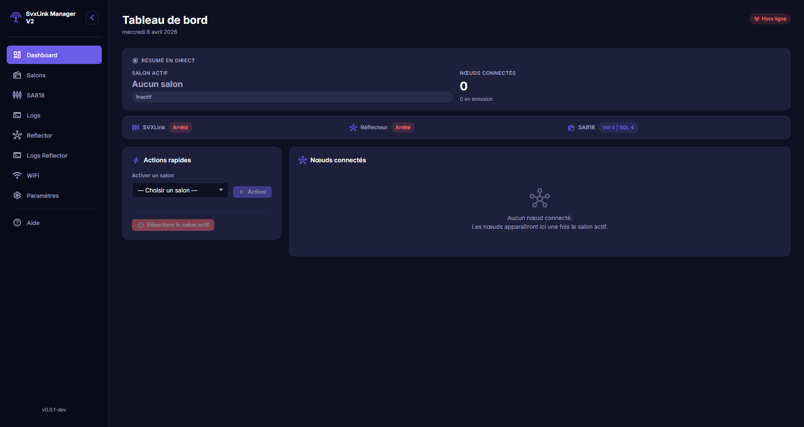

### Salons

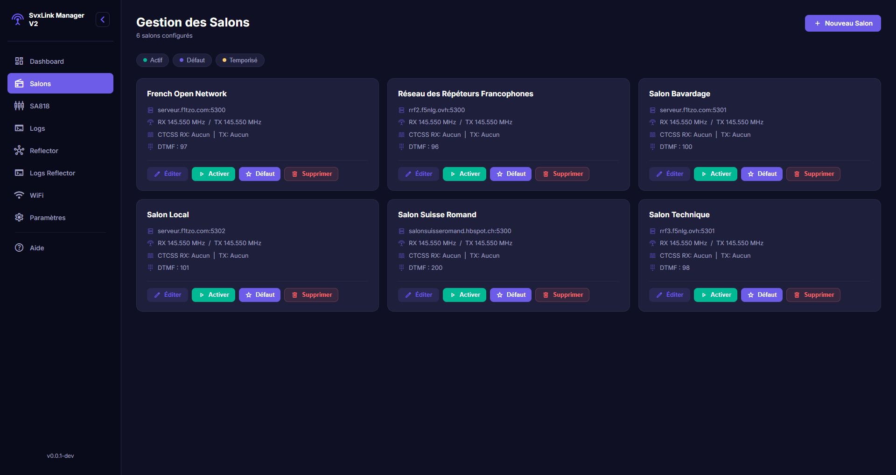

### Creation d'un salon

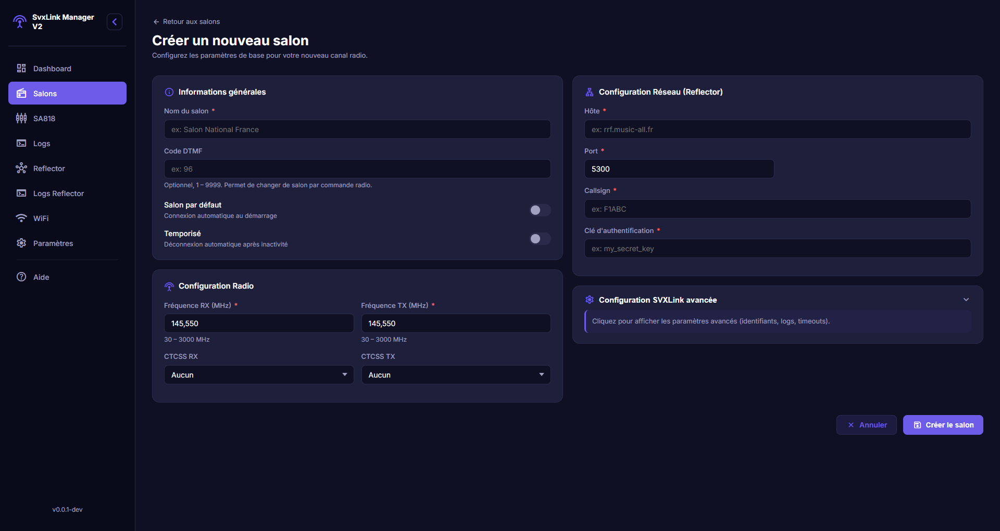

### Edition d'un salon (configuration avancee)

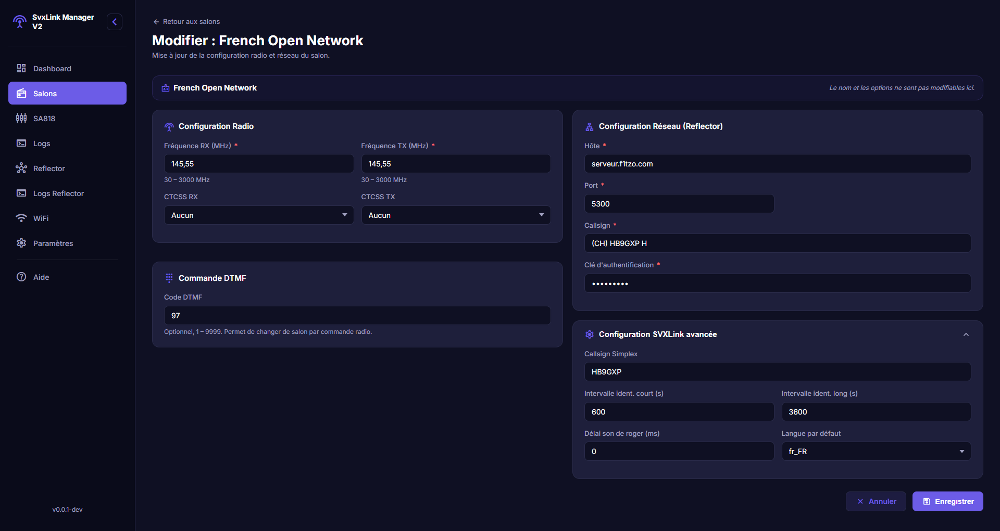

### Module SA818

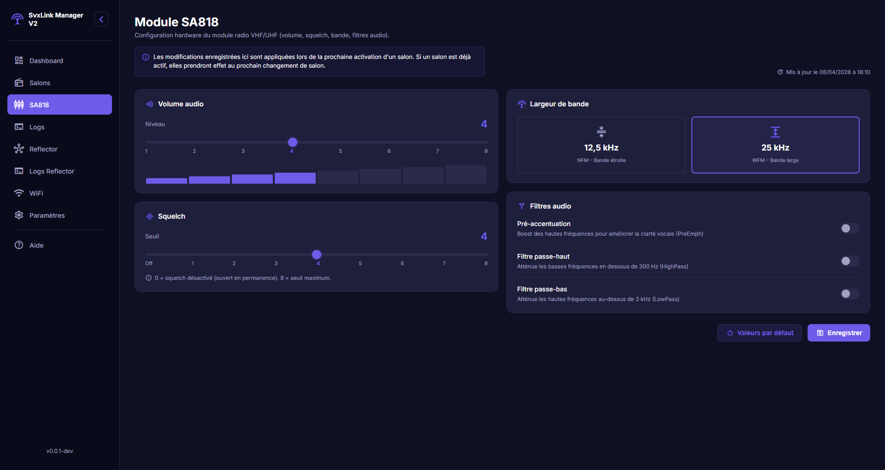

### Logs SVXLink

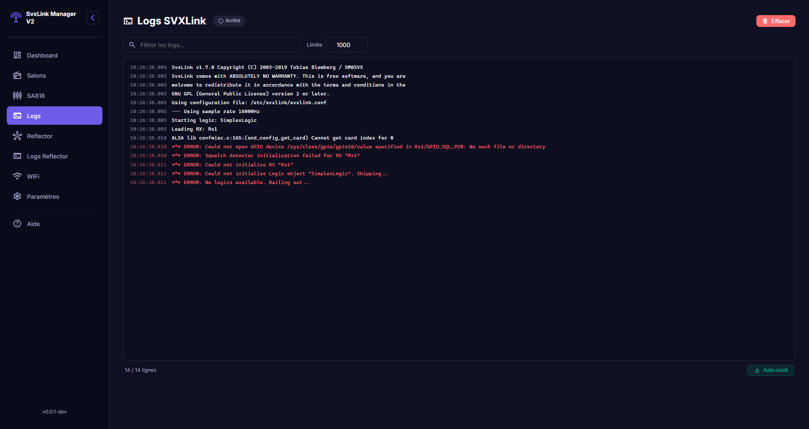

### Reflector

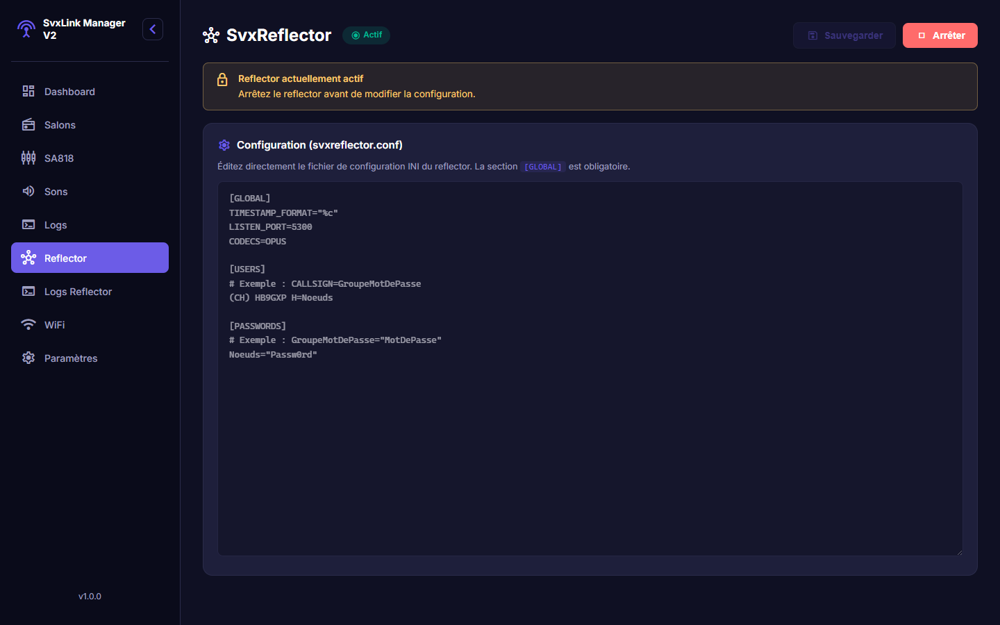

### Logs Reflector

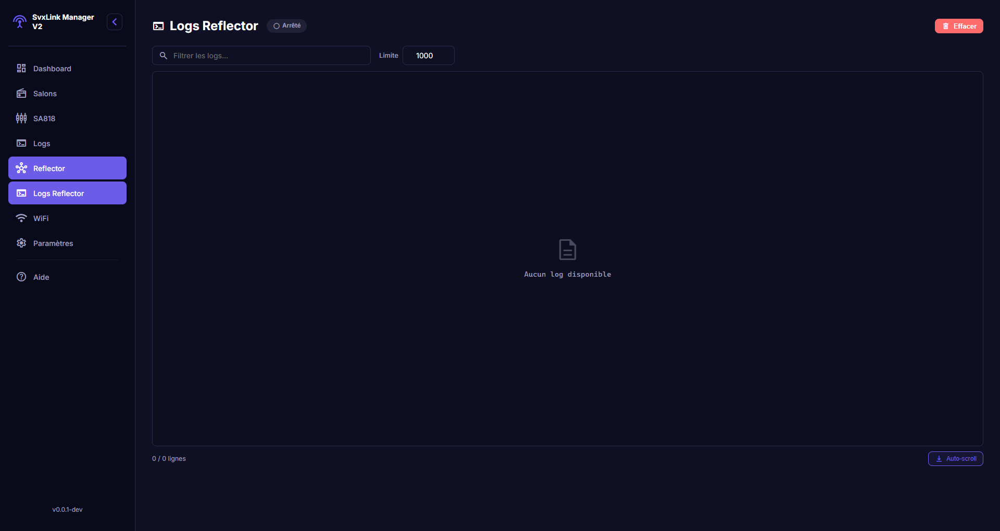

### Wi-Fi

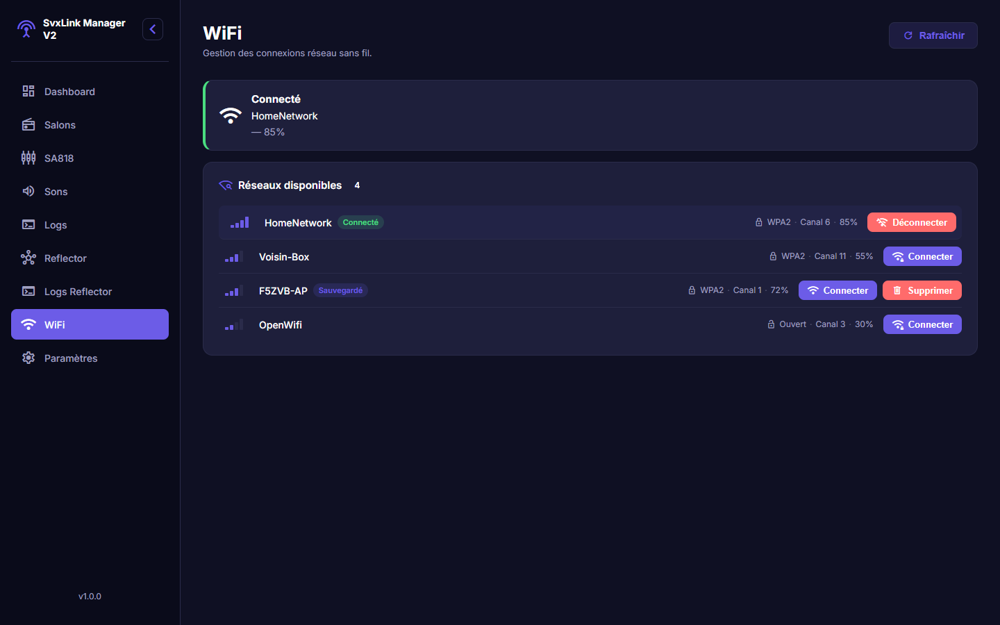

### Parametres et mises a jour

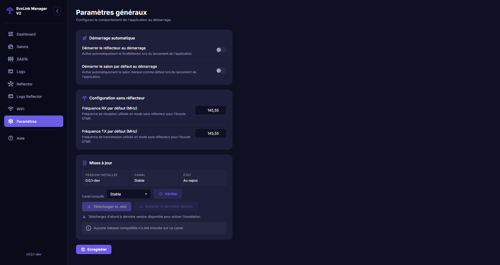

### Aide — Commandes DTMF

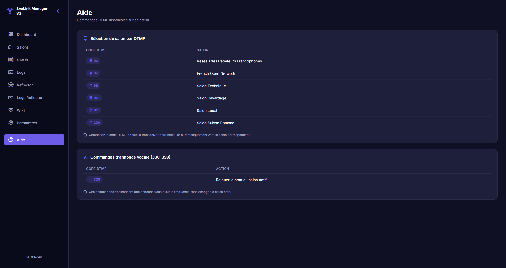

## Pour qui

SvxLink Manager V2 cible principalement :

- les radioamateurs qui exploitent un noeud SVXLink
- les responsables de relais/noeuds qui veulent une interface unifiee
- les installations qui ont besoin d'operations rapides sans passer par des editions manuelles de fichiers

## Resultat attendu en exploitation

Avec ce logiciel, l'exploitation quotidienne est plus fiable et plus rapide : moins de manipulations manuelles, meilleure visibilite de l'etat de la station, changements de configuration plus sereins, et mises a jour sans intervention manuelle sur le systeme.
